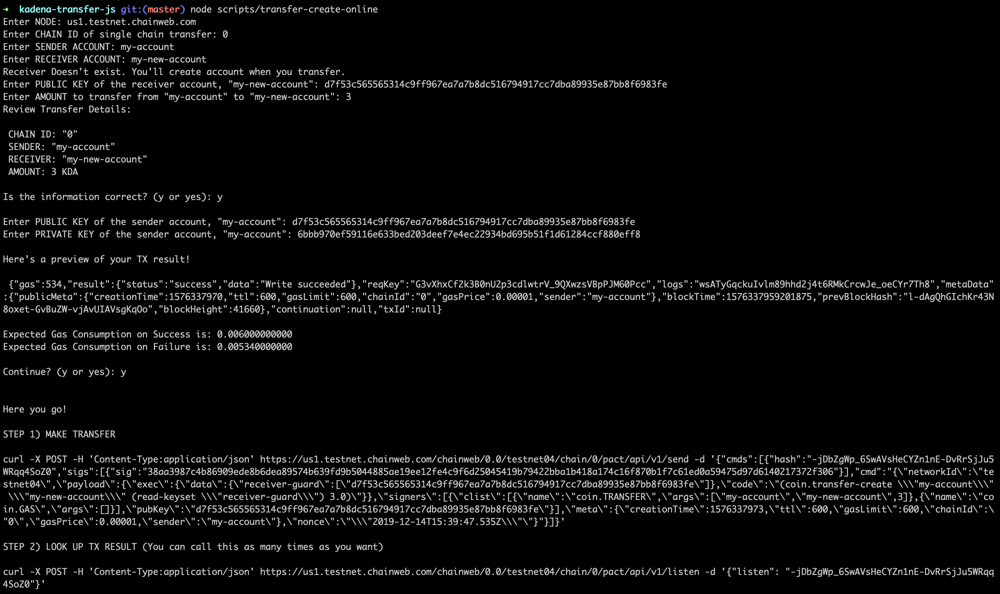
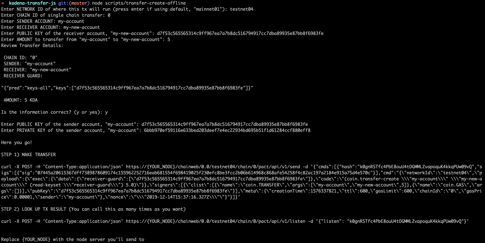

# kadena-transfer-js

## Setup

- Install Node.js

## Single Chain Transfer

There are two ways to transfer KDA in Chainweb on a single chain.
  1. `transfer`
  2. `transfer-create`


You can learn more about KDA coin contract [here](https://github.com/kadena-io/chainweb-node/blob/master/pact/coin-contract/coin.pact).

### transfer-create

**transfer-create** is executed between:   
- One EXISTING account and one NON-EXISTING account that will be created by this transaction
- Two EXISTING accounts

The function takes in the following arguments:
- Sender Account
- Receiver Account
- Receiver Guard
- Amount

and requires a signature of the sender Keypair.

You should use this function if you are creating a new account and transferring KDA coin.
If you already have the receiver account, this function is still useful if you know the guard of the receiver account.
This will be a more conservative approach than `coin.transfer` which prevents you from transferring to a wrong account by checking the receiver guard.

If you want to create the command completely offline, use:
```
node scripts/transfer-create-offline.js
```
Here's an example screenshot of script.  


If you want to create the command with account validations and guard checks, use:
```
node scripts/transfer-create-online.js
```
Here's an example screenshot of script.  


### transfer

**transfer** is executed between:
- Two EXISTING accounts.

The function takes in the following arguments:
- Sender Account
- Receiver Account
- Amount

and requires a signature of the sender keypair.

You should use this function ONLY IF you are completely sure about the receiver account.

If you want to create the command completely offline, use:
```
node scripts/transfer-offline.js
```
If you want to create the command with account validations and guard checks, use:
```
node scripts/transfer-online.js
```

## Cross Chain Transfer

Cross chain transfer is a more complex transaction than single chain transfer, in that it involves a stepwise function with two steps and SPV proof fetching. You can learn more about the concept of ["pacts"](https://pact-language.readthedocs.io/en/latest/pact-reference.html#asynchronous-transaction-automation-with-pacts), which is a sequential transactions in Pact Language. Simply speaking, user needs to make 3 requests in order to make a cross chain transfer while user can complete a single chain transfer with 1 request:
1. Initiate the transfer on the source chain. (step 1)
2. Fetch SPV proof on the source chain.
3. Complete the transfer on the target chain. (step 2)

### transfer-crosschain

  **transfer-crosschain** is executed between:
  - One EXISTING account on one chain and one EXISTING account on a different chain
  - One EXISTING account on one chain and one NON-EXISTING account on a different chain that will be created by this transaction

  The function takes in the following arguments:
  - Sender Account
  - Receiver Account
  - Receiver Guard
  - Target Chain
  - Amount

  and requires:
   - a signature of the sender keypair on the source chain
   - gas payer of the target chain
   - a signature of gas payer on the target chain.

   If you want to create the command completely offline, use:
   ```
   node scripts/cross-chain-transfer-offline.js
   ```
